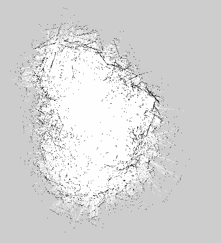
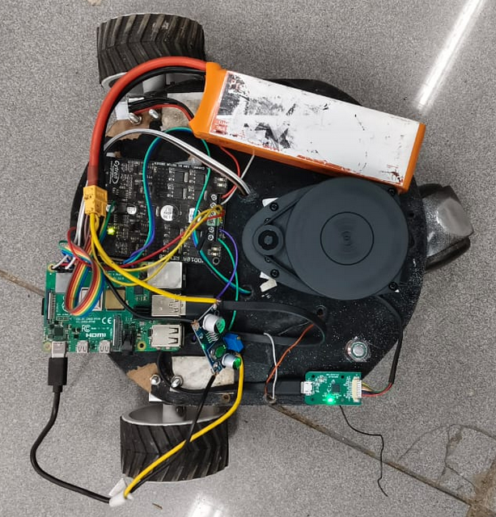

# Autonomous Mobile Robot (AMR) – ROS 2 Humble (Gazebo & Hardware)

This project demonstrates an **Autonomous Mobile Robot (AMR)** developed using **ROS 2 Humble** on **Ubuntu 22.04**. It features a dual-stage development pipeline: a high-fidelity simulation in **Gazebo Classic 11** and a physical hardware implementation using custom motor drivers and sensors. The robot performs **mapping, localization, and navigation** in both virtual and real-world environments.

---

## Features

- **Hybrid Deployment**: Seamlessly switch between **Gazebo Classic 11** simulation and **physical hardware**.
- **SLAM Mapping**: Generate 2D occupancy grid maps using **SLAM Toolbox**.
- **Autonomous Navigation**: Reach user-defined goals with global and local path planning using the **Nav2** stack.
- **Hardware Interfacing**: Custom Python nodes (`motor_driver_node.py` and `motor_encoder_bridge.py`) bridge ROS 2 commands to physical actuators.
- **Velocity Multiplexing**: Managed command priorities using `twist_mux` to handle teleop and autonomous inputs safely.
- **Real-time Visualization**: Monitor sensor data, robot pose, and live camera feeds in **RViz2**.

---
## Media
### Mapping 
 

### Bot 
 

### Demo Video
[![Watch the Demo]](https://drive.google.com/drive/folders/1BYQcUc7CnXSpuvwmU4K5HlSZyIYC0h7z?usp=sharing)
---

## Directory Structure

```text
amr/
├── AMR/
│   └── nodes/
│       ├── motor_driver_node.py       # Physical motor driver interface
│       └── motor_encoder_bridge.py    # Odom/Encoder hardware bridge
├── config/                            # Configuration files
│   ├── diff_drive_controller.yaml     # Controller parameters
│   ├── display_robot.rviz             # RViz configuration
│   ├── gazebo_params.yaml             # Gazebo simulation settings
│   ├── mapper_params_online_async.yaml # SLAM configuration
│   ├── nav2_params.yaml               # Navigation stack parameters
│   └── twist_mux.yaml                 # Velocity priority config
├── description/                       # Robot URDF/Xacro models
│   ├── camera.xacro                   # Camera sensor description
│   ├── lidar.xacro                    # LiDAR sensor description
│   ├── robot.urdf.xacro               # Main robot Xacro
│   └── ros2_control.xacro             # Hardware interface config
├── launch/                            # Launch scripts
│   ├── launch_sim.launch.py           # Full simulation bringup
│   ├── navigation_launch.py           # Nav2 stack bringup
│   ├── online_async_launch.py         # SLAM Toolbox bringup
│   ├── rplidar.launch.py              # Hardware LiDAR driver
│   └── rsp.launch.py                  # Robot State Publisher
├── world/
│   └── model.sdf                      # Simulation world file
├── package.xml                        # Project dependencies
└── setup.cfg                          # Package configuration
```

## System Requirements
```text
Prerequisites
OS: Ubuntu 22.04 LTS
ROS 2: Humble
Simulator: Gazebo Classic 11
```
```text
Install Dependencies

sudo apt update
sudo apt install -y \
  ros-humble-navigation2 \
  ros-humble-nav2-bringup \
  ros-humble-slam-toolbox \
  ros-humble-gazebo-ros-pkgs \
  ros-humble-twist-mux \
  ros-humble-robot-state-publisher \
  ros-humble-xacro \
  ros-humble-ros2-control \
  ros-humble-ros2-controllers
```
```text
## Usage Guide

Simulation Mode
To launch the robot in Gazebo with ros2_control enabled:

ros2 launch amr launch_sim.launch.py


Hardware Mode
To bring up the physical robot:

# 1. Start Robot State Publisher
ros2 launch amr rsp.launch.py

# 2. Start Hardware Sensors (LiDAR)
ros2 launch amr rplidar.launch.py

# 3. Start Hardware Bridge Nodes
ros2 run amr motor_driver_node.py
ros2 run amr motor_encoder_bridge.py

SLAM & Navigation
To generate a map:
ros2 launch amr online_async_launch.py

To navigate using a saved map:
ros2 launch amr navigation_launch.py
```

📄 License
This project is licensed under the MIT License.
